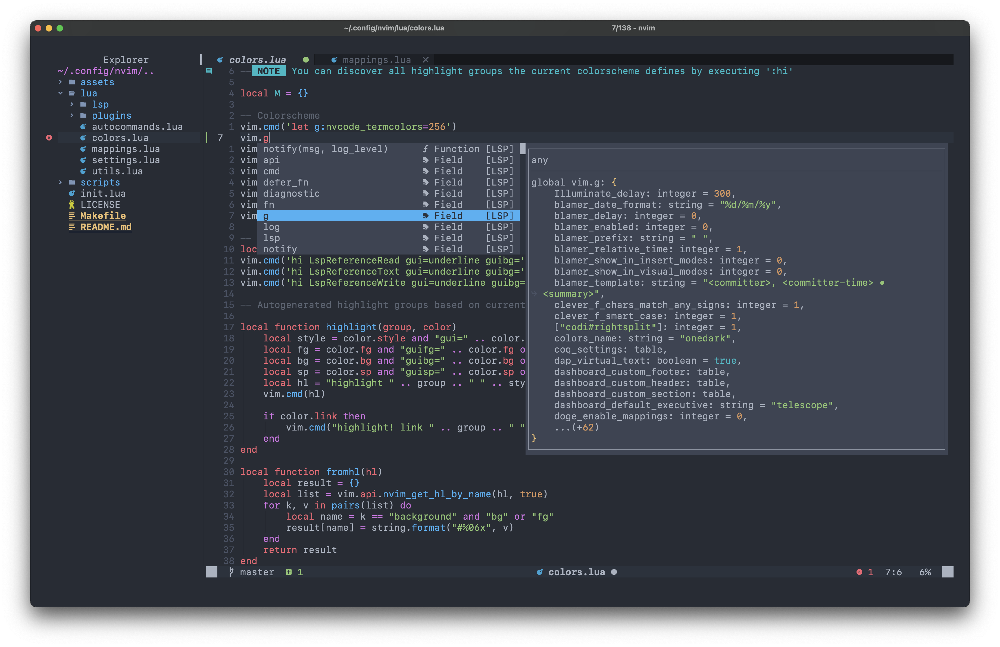
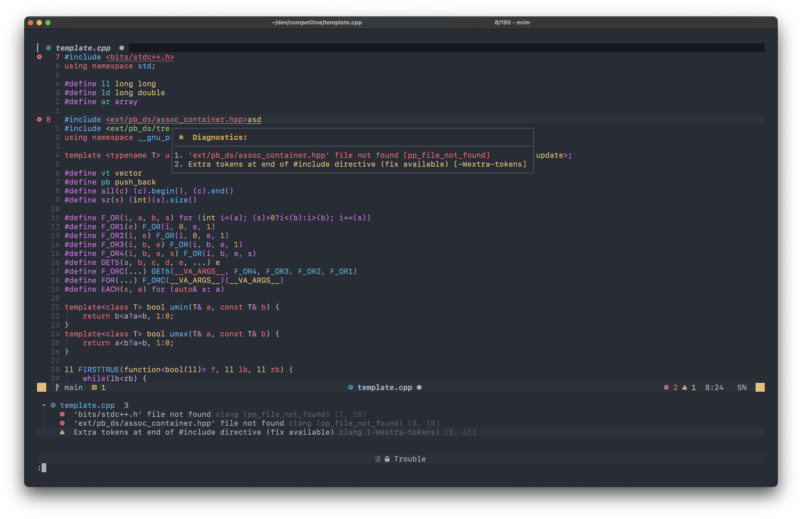
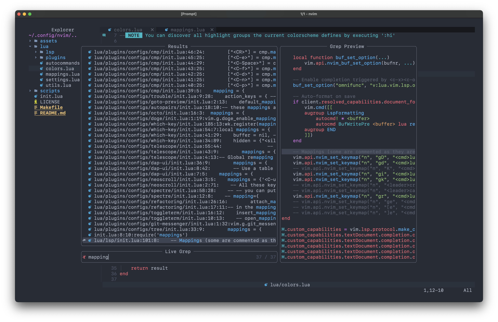
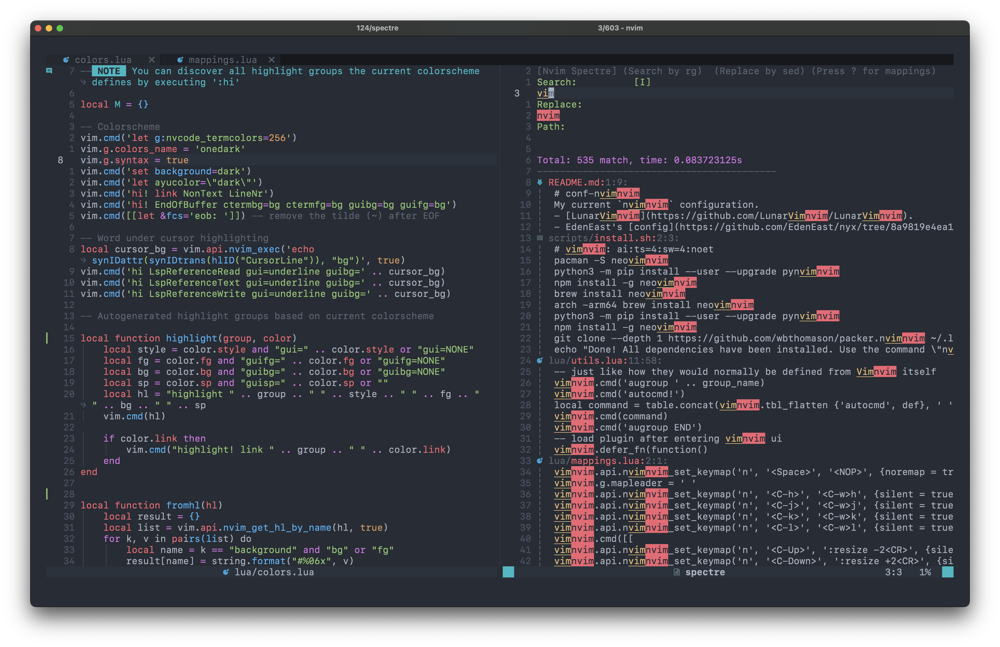
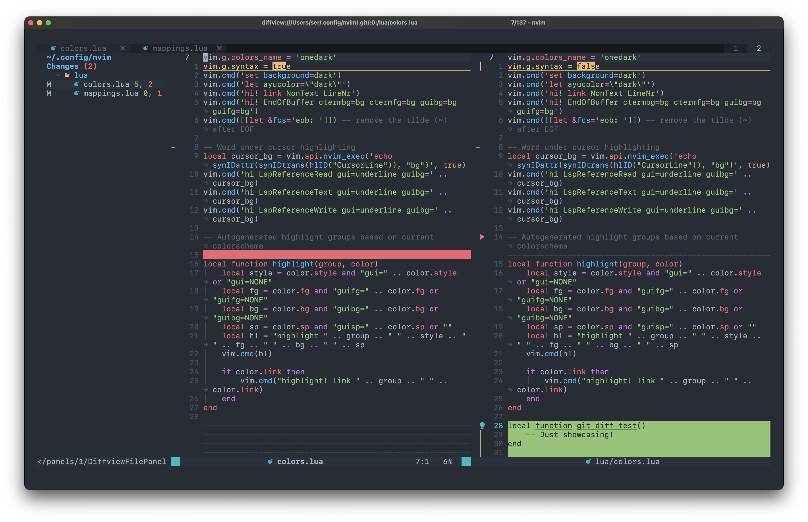

# My Neovim config

This is my current `nvim` configuration. This is not a generic or customization oriented config: my current focus is on web development (`Go`, `Vue`, `TypeScript`, `TailwindCSS`, etc.), machine learning on `Python` and also some `C/C++`, hence this config will be adapted mostly to that. Nonetheless, it is hopefully easy to tweak for other purposes.

## Examples of features

### Completion

### Diagnostics

### Searching files, words, etc.

### Search and replace

### Git diff

## Performance

I'm using a lot of plugins (+70!). This can be scary for most people as it generally correlates to poor performance, and performance is a top reason why a lot of people use n/vim. However, this config runs fairly fast thanks, mostly, to lazy loading: most plugins are only loaded when used via their commands or on specific events. While surely not the fastest config out there, I am dropping a personally acceptable amount of performance for great functionality gains, which in my view and for my use cases is worth it. If you are aiming for an extremely fast n/vim experience (we are talking about almost vanilla vim here), you may be better off looking for a more lightweight config.

After performing some startup time tests, these are the results obtained in an M1 Pro 2021 MacBook Pro (note that there will be variance in your experiences, based on a variety of factors):

- Starting up nvim without opening a file: `~75 ms`
- Starting up nvim opening a ~100 lines file: `~135 ms`

There is still a lot of room for improvement on this front, as there are still many plugins not optimized via lazy loading (e.g., DAP plugins) and some other optimizations can also be applied. I will continue iterating and improving the config to try to reach the targets of `50 ms` for non-file startups and `100 ms` for file startups.

## Acknowledgments

First of all, I must acknowledge the work of the `Neovim` team and contributors, as well as the developers who contribute to the nvim plugin ecosystem. After all, this config is just their work glued together in a certain way.

I have been inspired by many open source configs and pieces of code out there in order to develop different parts and features of this config. These include (but are not limited to):

- [LunarVim](https://github.com/LunarVim/LunarVim)
- [NvChad](https://github.com/NvChad/NvChad)
- EdenEast's [config](https://github.com/EdenEast/nyx/tree/8a9819e4ea11193434b2366b9f1d65ed3a4661f3/config/.config/nvim)
